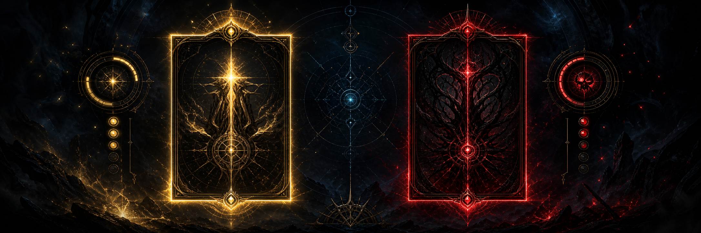

<p align="center">
  
</p>

<h1 align="center">Altar Helper V2</h1>

<p align="center">
  A visual ExileCore overlay that scores Eldritch Altar options and makes the best choice immediately readable.
</p>

<p align="center">
  Extended fork of <a href="https://github.com/bruno105/AltarHelper">bruno105/AltarHelper</a>.
</p>

> [!IMPORTANT]
> This is an independent, community-made project. It is not affiliated with or endorsed by Grinding Gear Games.

## Origin and credits

Altar Helper V2 is an expanded fork of the original [AltarHelper by bruno105](https://github.com/bruno105/AltarHelper). The original plugin introduced the weighted Primordial Altar comparison that this version builds upon. Thanks to bruno105 and the original contributors, including the testing and modifier-configuration work credited upstream.

This fork adds a redesigned visual overlay and settings UI, target modes, veto rules, presets, alerts, unknown-mod inspection, parser hardening, documentation, and ExileCore 3.28 compatibility work.

## What it does

- highlights the recommended altar option with a configurable frame and background;
- marks dangerous choices in red;
- displays a compact score, a `TAKE` indicator, and the most important modifier;
- distinguishes player, minion, and final-boss modifiers with colored dots;
- supports positive and negative veto thresholds;
- provides searchable weights, quick presets, sound alerts, and an unknown-mod inspector.

## Installation

1. Download or clone this repository into `Plugins/Source/AltarHelperV2` inside your ExileCore directory.
2. Start ExileCore and wait for the plugin to compile.
3. Open the ExileCore plugin menu, select `AltarHelperV2`, and enable it.
4. Configure weights under **Mods & Weights (V2)** or apply one of the quick presets.

For a manual build, install the .NET 10 SDK and run:

```powershell
dotnet build -p:exapiPackage="D:\path\to\ExileCore"
```

The specified directory must contain `ExileCore.dll` and `GameOffsets.dll`.

## Visual language

| Signal | Meaning |
|---|---|
| Gold | Positive-veto choice; highest priority |
| Yellow | Recommended choice |
| Orange | Mixed upside and downside |
| Red | Avoid / negative veto |
| Green dot | Eldritch minions |
| Cyan dot | Player |
| Blue dot | Final map boss |

Press `F7` by default to switch between **Any**, **Minions + Player**, and **Boss + Player** modes.

## Configuration notes

> [!WARNING]
> The bundled weights and alert rules are the maintainer's personal configuration. Review every configured value before playing: priorities depend on your build, risk tolerance, farming strategy, and the current league economy.

Weights are personal priorities, not live prices. A positive value rewards a modifier; a negative value penalizes it. The bundled defaults and presets are starting points and may become outdated as the economy changes. Set a positive veto threshold for rewards you never want to miss, and a negative veto threshold for modifiers your build cannot safely run.

Sound file names refer to files from ExileCore's `Sounds` directory. The plugin reads only the visible altar UI and stores settings locally; it does not send telemetry or make network requests.

## Troubleshooting

- **Plugin does not compile:** confirm the folder is under `Plugins/Source` and ExileCore is current.
- **No highlight appears:** enable the plugin and assign non-zero weights or apply a preset.
- **A modifier is not recognized:** expand **Unknown Mods**, then use **Find** to locate and configure it.
- **Sound does not play:** confirm the `.wav` file exists in ExileCore's `Sounds` directory.
- **Manual build cannot find dependencies:** pass `-p:exapiPackage="..."` as shown above.

Please include the ExileCore version, game version, `Errors.txt`, and a screenshot when reporting a bug.

## FAQ — how does it work?

### How is an altar option scored?

The plugin reads both visible altar choices and normalizes changing numbers to `#` placeholders. It then looks up every modifier in the weights table:

```text
option score = total upside weight - total downside weight + target bonus
```

The option with the highest positive effective score is highlighted. An option with a score of zero is not recommended. If both valid options have the same score, both are highlighted.

### What do positive and negative weights mean?

- A positive weight increases the value of a reward.
- A negative weight represents a dangerous or unwanted modifier.
- `0` means the modifier has no influence on the decision.

The same number can be wrong for another character. Review all bundled values for your build and farming strategy.

### What are positive and negative veto thresholds?

A veto looks at the strongest single modifier instead of only the final sum:

- **Positive Veto** forces a sufficiently valuable choice to be treated as a priority. It takes precedence over a negative veto.
- **Negative Veto** marks a choice as dangerous when one downside reaches the configured threshold.
- A threshold of `0` disables that veto.

Example: a Divine Orb reward can remain a priority even when the same option contains a moderate downside.

### What do the three modes change?

Press `F7` or change **Mode** in settings:

- **Any** — scores every altar target.
- **Minions + Player** — scores modifiers affecting Eldritch minions or the player.
- **Boss + Player** — scores modifiers affecting the final map boss or the player.

Player modifiers are included in both specialized modes because they affect the character directly. **Minion bonus weight** and **Boss bonus weight** can further favor those target types.

### What do the colors mean?

- **Gold:** positive-veto priority.
- **Yellow:** recommended choice.
- **Orange:** recommended option containing both valued rewards and downsides.
- **Red:** dangerous option or negative veto.

All colors, frame thickness, and background opacity are configurable.

### What are the colored dots?

The dot identifies who receives the altar modifier:

- green — Eldritch minions;
- cyan — player;
- blue — final map boss.

Set **Dot size** to `0` to disable them.

### What do `Alert`, `Clear`, and the checkbox mean?

- **Alert** enables a sound notification for that modifier.
- **Clear** contains the `X` button that removes the custom weight and returns the modifier to `0`.
- A filled checkbox means the sound rule is enabled.

Positive modifier alerts use **Sound — Positive**. Downside alerts and dangerous choices use **Sound — Negative**. A negative warning takes priority so both sounds do not play simultaneously. **Alert delay** prevents the same warning from firing every frame.

### What do the display options control?

- **Show score overlay** — shows the calculated net score next to each choice.
- **Show top mod name** — shows the highest-impact modifier explaining the score.
- **Show TAKE arrow** — labels the recommended option.
- **Show background highlight** — fills recommended or dangerous choices with a translucent color.
- **Background highlight opacity** — controls the fill strength.

### What do the presets do?

Presets quickly assign a group of weights for a farming goal, such as Divine Orbs, Scarabs, or Eldritch Currency. Applying a preset does not clear unrelated configured weights. Preset values are only starting points and are not updated from live market prices.

### What are Unknown Mods?

This section lists altar text that was visible in game but could not be matched to the bundled modifier database. Use **Find** to search for the closest table entry. When reporting a missing modifier, include its complete raw text and the current game version.

### Does changing the source defaults overwrite existing settings?

No. ExileCore loads an existing local settings file when one is present. Bundled defaults apply to a new installation or after the plugin's saved settings are removed. Use **Reset All Weights** only when you intentionally want to clear configured weights.

### Does the plugin automate altar selection?

No. It reads the visible altar interface, calculates a recommendation, and draws an overlay. The player still makes the selection.

## Development

The project targets `net10.0-windows` and x64. Contributions are welcome; see [CONTRIBUTING.md](CONTRIBUTING.md). Release history is tracked in [CHANGELOG.md](CHANGELOG.md).

## License status

The upstream repository does not currently declare an open-source license. This fork therefore does not grant an MIT license over the inherited code. Rights to the original code remain with its respective author(s); contributions to this fork remain with their respective author(s) unless separately licensed.
